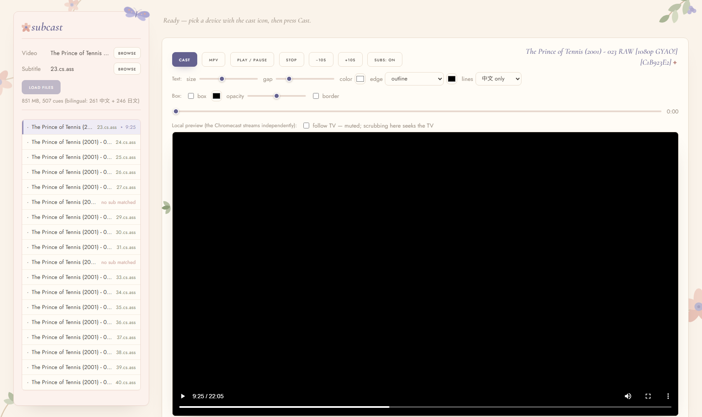

# subcast ✦

Cast local video with external subtitles (`.ass` / `.srt`) to a Chromecast, from a single-file, zero-dependency Node server — with a web UI for browsing folders, pairing episodes to subtitle files, and styling subtitles live on the TV.



Born from a simple problem: Chromecast can't play local files with sidecar subtitles, tab-mirroring is laggy, and 178 episodes of *The Prince of Tennis* with bilingual fansubs deserve better.

## Features

**Casting**
- Serves local video over HTTP with range requests (seeking works) and the CORS headers the Cast receiver demands
- Converts `.ass`/`.srt` → WebVTT on the fly; Chromecast plays the original file directly — no transcoding, no mirroring lag
- Full remote control from the browser: play/pause, stop, seek bar, ±10s

**Subtitles**
- CJK encoding auto-detection (UTF-8, UTF-16, Big5, GB18030, Shift_JIS)
- Bilingual `.ass` handling: detects Chinese/Japanese lines by script, serves them as three switchable tracks (中文 / 日本語 / both) — switch live without restarting the stream
- Near-simultaneous cues merge into one block (Chinese on top, Japanese below) so lines don't stack with huge gaps
- Live styling on the TV *and* in the browser player: size, line gap, colors, outline/shadow edges, background box

**Library**
- Pick separate video and subtitle folders; episodes pair automatically by filename or episode number (handles `[Group] Show - 023 [1080p][CRC].mp4` ↔ `23.cs.ass`)
- Paste a Windows path (`D:\...`) straight from Explorer — auto-converted for WSL
- Resume positions and watched-episode tracking survive restarts (`~/.subcast.json`)
- Browser preview player with custom-rendered subtitles, optionally synced two-way with the TV (scrub the preview, the TV follows)

**Extras (optional)**
- `mpv` button: open the current episode on the PC in mpv with Anime4K shaders and the correct subtitle attached
- `--enhance` flag: opt-in background GPU queue that pre-transcodes episodes through Anime4K restore shaders (ffmpeg + libplacebo + NVENC) and casts the enhanced copies automatically

## Quick start

```bash
node cast.js --advertise <your-LAN-IP>
```

Open the URL printed in the terminal (it includes a `?key=` that guards the file-browser API — devices on your LAN can only fetch the currently playing media). Pick your folders, click an episode, hit **Cast**.

### WSL2 note

The Chromecast can't reach WSL's virtual network. Run once in an admin PowerShell on Windows, then pass your Windows LAN IP as `--advertise`:

```powershell
netsh interface portproxy add v4tov4 listenport=8080 listenaddress=0.0.0.0 connectport=8080 connectaddress=<WSL-IP>
netsh advfirewall firewall add rule name="subcast" dir=in action=allow protocol=TCP localport=8080
```

The WSL IP (`hostname -I`) changes across reboots — re-run the first command if casting stops working, or enable `networkingMode=mirrored` in `.wslconfig` to avoid the whole dance.

## Requirements

- Node 18+ (uses built-in `TextDecoder` CJK encodings — full-ICU builds, which is the default)
- A Chromecast on the same LAN; video in a codec it can decode natively (H.264/VP9/AV1 + AAC/MP3/Opus — the server warns via `ffprobe` if available)
- Optional: mpv and ffmpeg (Windows builds) for the enhancement extras

## Notes

- Everything is one file: server, conversion, and the web UI (inline HTML/CSS/SVG — including the botanical decorations).
- Chromecast's receiver limits subtitle styling (no line-height, no per-line ASS positioning); the browser preview renders through a custom overlay and honors everything.
